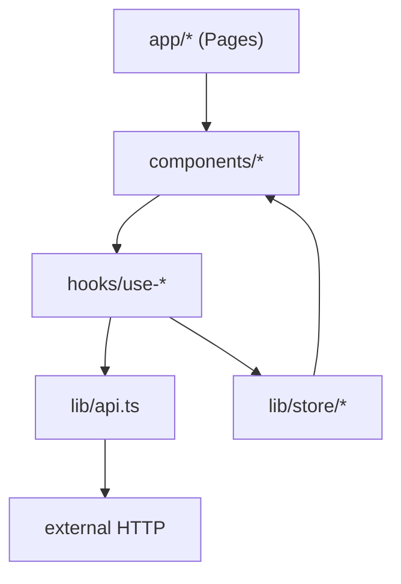

# Frontend Folder Structure Guide

`frontend/` 디렉토리의 폴더 구조와 역할 가이드입니다.

## 디렉토리 트리

```
frontend/
├── app/                    Next.js App Router 진입점
│   ├── layout.tsx          루트 레이아웃 (전역 폰트, 메타데이터)
│   ├── page.tsx            메인 페이지
│   └── globals.css         Tailwind v4 + shadcn 토큰 + brand 토큰
├── components/             React 컴포넌트
│   ├── ui/                 shadcn/ui 디자인 시스템
│   └── *.tsx               도메인 컴포넌트 (Phase 2~)
├── hooks/                  React 커스텀 훅 (Phase 2~)
├── lib/                    유틸/클라이언트/store
│   ├── api.ts              core-api 클라이언트 + S3 업로드
│   ├── mock-data.ts        Mock fixture 데이터
│   ├── utils.ts            cn() 등 클래스 유틸
│   └── store/              Zustand store
│       └── recommendation.ts
├── types/                  공유 타입 정의 (다음 단계)
└── public/                 정적 파일
```

## 레이어 책임 분리



| 레이어 | 책임 | 금지 사항 |
|--------|------|-----------|
| `app/` | 라우팅, 페이지 조합 | 비즈니스 로직, 직접 fetch |
| `components/` | UI 렌더링 | 직접 fetch, 직접 전역상태 mutate |
| `hooks/` | 흐름 제어, store 갱신 | UI 렌더링 (JSX 반환 X) |
| `lib/api.ts` | HTTP 통신 | UI/store 의존 |
| `lib/store/` | 전역 상태 보관 | 부수효과 (fetch 호출 등) |
| `types/` | 공유 타입만 | 런타임 코드 |

## Path Alias

`tsconfig.json` 의 `paths` 설정으로 `@/*` 절대경로 사용:

```ts
import { Button } from "@/components/ui/button";
import { requestPresignedUrl } from "@/lib/api";
import { useRecommendationStore } from "@/lib/store/recommendation";
```

## 파일명 컨벤션

| 종류 | 규칙 | 예시 |
|------|------|------|
| React 컴포넌트 | PascalCase | `RecorderPanel.tsx` |
| 훅 | `use-` + kebab-case | `use-recorder.ts` |
| 일반 모듈 | kebab-case | `mock-data.ts` |
| Next.js 특수 파일 | 소문자 (Next 규약) | `layout.tsx`, `page.tsx` |

## 환경별 진입 흐름

- **Mock 모드** (`NEXT_PUBLIC_USE_MOCK_API=true`): `lib/api.ts` 가 `lib/mock-data.ts` 를 동적 import 해 fixture 응답
- **Real 모드**: `lib/api.ts` 가 실제 `core-api` 호출

## Update Log

- 2026-04-28: 초기 폴더 구조 가이드 작성 (Phase 1)
